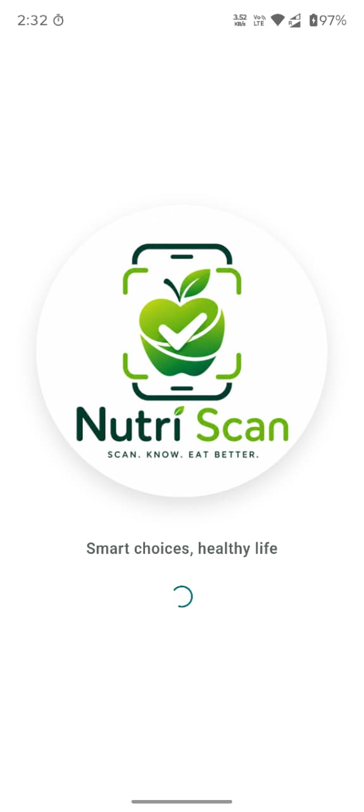
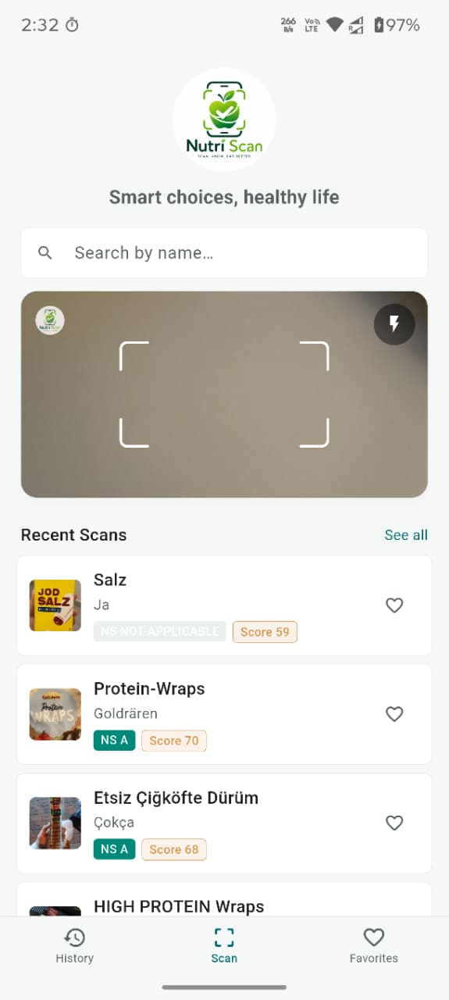
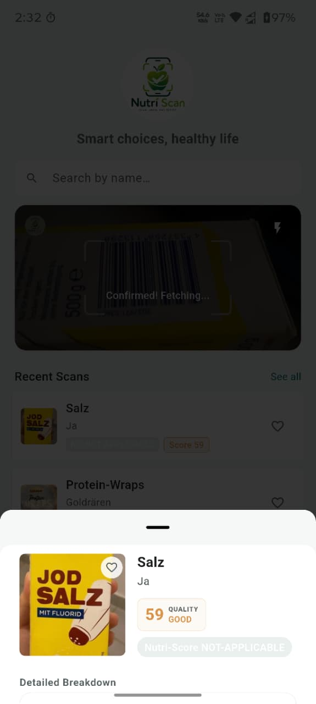
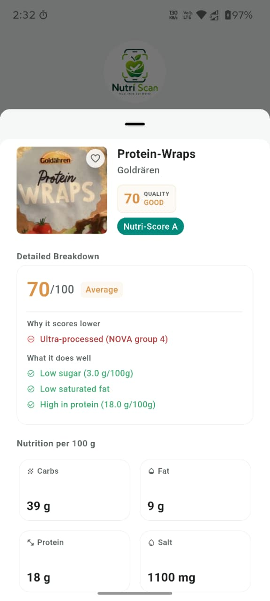
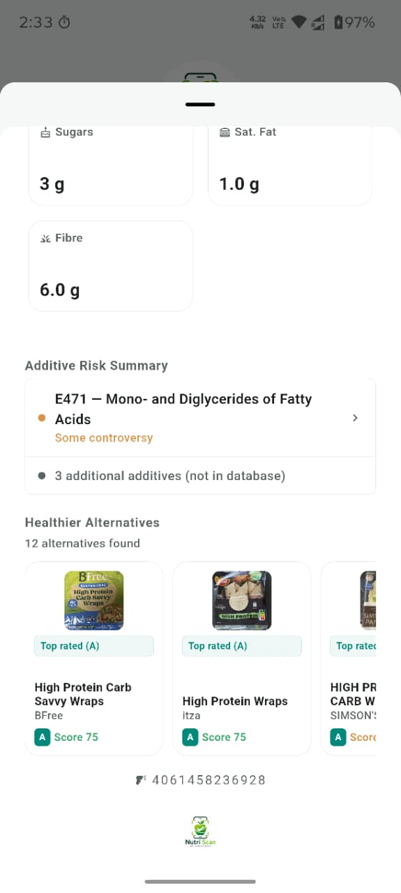
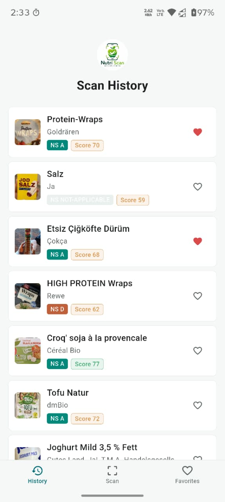
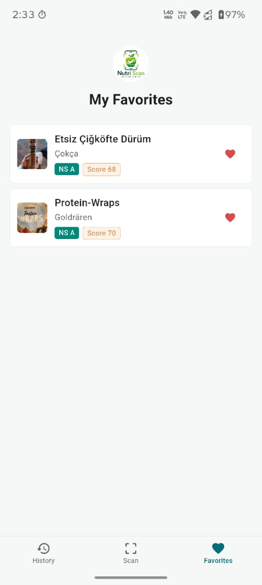

# Nutri Scan

Nutri Scan is a modern health and nutrition companion app built with Flutter. It empowers users to make smarter, healthier food choices by providing instant access to detailed nutritional data, ingredient analysis, and additive risk assessments.

---

## App Screenshots

### Core Experience
| 1. Splash Screen | 2. Barcode Scanner | 3. Product Peek |
| :---: | :---: | :---: |
|  |  |  |

### Nutritional Insights & Alternatives
| 4. Detailed Breakdown | 5. Healthier Alternatives |
| :---: | :---: |
|  |  |

### History & Personalization
| 6. Scan History | 7. My Favorites |
| :---: | :---: |
|  |  |

---

## Download Compiled APKs

You can download the compiled production APKs directly from the repository:

*   **[Download arm64-v8a APK (12.3 MB)](apks/app-arm64-v8a-release.apk)** *(Recommended for most modern phones)*
*   **[Download armeabi-v7a APK (11.6 MB)](apks/app-armeabi-v7a-release.apk)** *(For older 32-bit devices)*
*   **[Download x86_64 APK (12.9 MB)](apks/app-x86_64-release.apk)** *(For emulators)*
*   **[Download Fat APK (30.2 MB)](apks/app-release.apk)** *(Contains all architectures in one bundle)*

---

## Key Features

### 1. High-Precision Barcode Scanning
*   **Embedded Scanner**: A persistent, lightning-fast barcode scanner integrated directly into the Scan tab utilizing `mobile_scanner`.
*   **Multi-Database Fallbacks**: Automatically checks Open Food Facts (for food), Open Beauty Facts (for cosmetics/lotions), and Open Pet Food Facts to maximize barcode recognition.

### 2. Live Product Search
*   **Real-time Suggestions**: Allows manual search for products by name or barcode, fetching live suggestions and matches dynamically.

### 3. Detailed Health Insights
*   **Composite Quality Score (0-100)**: A proprietary rating combining Nutri-Score, NOVA Group (level of processing), presence of high-risk additives, and macronutrient profile.
*   **Visual Grades**: Instant display of official Nutri-Score (A-E) and Eco-Score (A-E) badges.
*   **Additive Risk Profiling**: Detects E-numbers, categorizes them by risk level (Safe, Moderate, Concern), and explains their functions and health notes.
*   **Interactive Ingredient Explainer**: Tapping on any ingredient shows what it is, why it's added, and potential health warnings.

### 4. Intelligent Healthier Alternatives
*   **Category-Aware Routing**: Browses the specific categories of the scanned product (e.g., chocolates, sodas) directly from the API.
*   **Smart Scoring & Badging**: Scores alternative products, labeling them with clear benefits such as "Better Nutri-Score (A)", "Higher quality (+15 pts)", or "Top rated".

### 5. Local Scan History & Favorites
*   **No Data Loss**: Scanned history and bookmarked favorites persist locally, instantly loading when you open the app.

---

## Architecture & Project Structure

The project is structured under the standard Flutter architecture inside the [lib](lib) folder:

```
lib/
├── core/
│   └── theme.dart              # Modern Botanical Theme (Deep Teals, Sage, Warm Grays)
├── models/
│   ├── additive_info.dart      # Additives model and risk databases
│   └── product_summary.dart    # Lightweight representation of products for storage
├── screens/
│   └── product_detail_screen.dart # Interactive peek sheet with full info layout
├── services/
│   └── storage_service.dart    # Local persistence manager using SharedPreferences
├── utils/
│   └── helpers.dart            # Scoring algorithms, color helpers, and sanitizers
└── widgets/
    ├── alternatives_section.dart # Multi-strategy category alternatives search list
    ├── bottom_sheets.dart       # Peek bottom sheet helpers
    ├── scanner_widget.dart      # Embedded mobile scanner layout & consensus logic
    └── ui_components.dart       # Reusable badges, buttons, and section cards
```

---

## Technical Improvements

### 1. Local Data Persistence
*   Implemented [StorageService](lib/services/storage_service.dart) which utilizes `shared_preferences` to store scanned history and favorites locally as serialized JSON.
*   Connected [ProductSummary](lib/models/product_summary.dart) objects to be loaded automatically in `initState()` on [main.dart](lib/main.dart) and saved after mutations.

### 2. Intelligent Alternatives Engine
The revamped [AlternativesSection](lib/widgets/alternatives_section.dart) solves issues where alternatives weren't found by using a 4-tier search strategy:
1.  **Category Browsing API**: Browses the most specific category tag (e.g. `en:chocolates`) directly via `/category/<tag>.json` sorted by popularity (`sort_by=unique_scans_n`).
2.  **Broader Category Fallback**: If the tag yields fewer than 5 results, it searches the next broader category.
3.  **Category Name Search**: Queries the textual name of the category.
4.  **Keyword Search**: Extracts product name keywords and performs a fallback text query.

Candidates are evaluated and assigned dynamic priority scores:
*   *Strictly Better Nutri-Score* -> Better Nutri-Score label.
*   *Quality Score > Current Quality + 5* -> Higher Quality label.
*   *Nutri-Score A or B* -> Top Rated label.
*   *Quality >= 60* -> Good Option label.

### 3. APK Size Optimization
Applied advanced Gradle packaging and build configs to reduce the APK footprint by over 60%:
*   **Logo Compression**: Compressed the high-resolution logo from 937 KB to 231 KB (75% savings).
*   **R8 Code Shrinking**: Enabled `minifyEnabled = true` to remove unused classes.
*   **R8 Resource Shrinking**: Enabled `shrinkResources = true` to strip unused assets.
*   **ProGuard Integration**: Created [proguard-rules.pro](android/app/proguard-rules.pro) to handle shrinking warnings while preserving essential Flutter, ML Kit, and SharedPreferences components.
*   **Icon Tree-Shaking**: Stripped unused icons, reducing the font file size from 1.6 MB to 5 KB.
*   **ABI Splits**: Enabled split APKs, bringing individual architectural builds down to ~12 MB from the 30.2 MB fat APK.

---

## Build & Development Instructions

### Prerequisites
*   Flutter SDK (v3.19.0 or higher recommended)
*   Android SDK / Command-line Tools (for builds)

### Commands

**1. Fetch Dependencies:**
```bash
flutter pub get
```

**2. Run Linter / Static Analysis:**
```bash
flutter analyze
```

**3. Run App in Debug Mode:**
```bash
flutter run
```

**4. Build Optimized Split APKs:**
```bash
flutter build apk --release --split-per-abi
```

---

*Note: Nutri Scan is an educational project. All nutritional data is queried in real-time from the community-maintained databases on Open Food Facts.*
